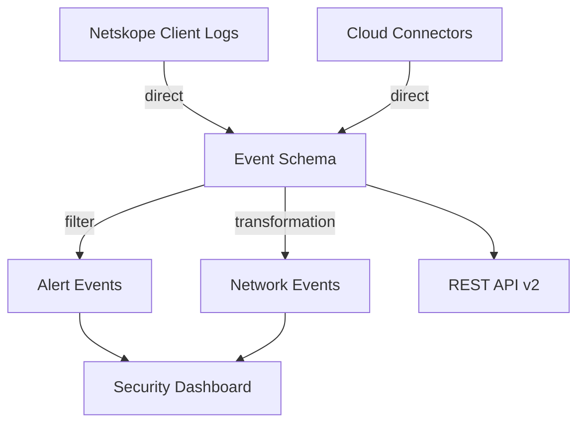

# Data Lineage Visualization Guide

## Overview

This guide explains how to visualize and interpret data lineage information in the Netskope Data Catalog.

## What is Data Lineage?

Data lineage is a visual representation that shows:
- **Where data comes from** (upstream sources)
- **How data transforms** (transformations and processing)
- **Where data goes** (downstream consumers)

## Lineage Graph Structure

### Node Types

1. **Source Nodes** (Upstream)
   - API Connectors
   - Cloud Services
   - Network Monitors
   - File Systems
   - Databases

2. **Dataset Nodes** (Current)
   - Event Schema
   - Transaction Events
   - Alert Events
   - Network Events

3. **Consumer Nodes** (Downstream)
   - Dashboards
   - Reports
   - APIs
   - ML Models
   - Analytics Systems

4. **Transformation Nodes**
   - Filters
   - Aggregations
   - Joins
   - Enrichments
   - Validations

### Edge Types

- **Direct Connection**: Data flows without transformation
- **Transformation**: Data is modified during flow
- **Aggregation**: Multiple sources combined
- **Join**: Data merged from multiple sources

## Example Lineage Flow

```
┌─────────────────────┐
│ Netskope Client     │ (Source)
│ Logs                │
└──────────┬──────────┘
           │
           │ direct
           ▼
┌─────────────────────┐
│ Enrich User Info    │ (Transformation)
│ JOIN user_directory │
└──────────┬──────────┘
           │
           │ transformation
           ▼
┌─────────────────────┐
│ Event Schema        │ (Dataset)
│ 748 fields          │
└─────┬─────┬─────┬───┘
      │     │     │
      │     │     └──────────────┐
      │     │                    │
      │     └────────────┐       │
      │                  │       │
      ▼                  ▼       ▼
┌──────────┐      ┌──────────┐  ┌──────────┐
│Security  │      │Compliance│  │REST API  │ (Consumers)
│Dashboard │      │Reports   │  │v2 Export │
└──────────┘      └──────────┘  └──────────┘
```

## Visualization Approaches

### 1. Hierarchical Layout (Top-Down)

Best for showing clear upstream to downstream flow:

```
         Sources
            ↓
      Transformations
            ↓
         Dataset
            ↓
        Consumers
```

**Use When**:
- Simple linear flows
- Clear hierarchical relationships
- Presenting to non-technical audiences

### 2. Force-Directed Graph

Best for complex interconnected systems:

```
    [Source A]
       ↓    ↘
       ↓     [Transform]
       ↓    ↗    ↓
   [Dataset] → [Dashboard]
       ↓
   [Report]
```

**Use When**:
- Multiple interconnected datasets
- Exploring complex dependencies
- Interactive exploration needed

### 3. Sankey Diagram

Best for showing data volume flow:

```
Source A ─────────────┐
                      ├─→ Dataset ─────→ Dashboard
Source B ─────────────┘              └→ Report
         (width = volume)
```

**Use When**:
- Showing data volume/importance
- Highlighting major data paths
- Resource planning

## Implementation Examples

### Using D3.js

```javascript
// Sample lineage graph data structure
const lineageData = {
  nodes: [
    {id: "netskope_logs", name: "Netskope Client Logs", type: "source"},
    {id: "event_schema", name: "Event Schema", type: "dataset"},
    {id: "dashboard", name: "Security Dashboard", type: "consumer"}
  ],
  links: [
    {source: "netskope_logs", target: "event_schema", type: "direct"},
    {source: "event_schema", target: "dashboard", type: "direct"}
  ]
};

// D3.js force-directed graph
const simulation = d3.forceSimulation(lineageData.nodes)
  .force("link", d3.forceLink(lineageData.links).id(d => d.id))
  .force("charge", d3.forceManyBody().strength(-300))
  .force("center", d3.forceCenter(width / 2, height / 2));
```

### Using Mermaid (Markdown)



### Using Cytoscape.js

```javascript
const cy = cytoscape({
  container: document.getElementById('lineage'),
  elements: [
    // Nodes
    {data: {id: 'source', label: 'Source'}},
    {data: {id: 'dataset', label: 'Dataset'}},
    {data: {id: 'consumer', label: 'Consumer'}},
    // Edges
    {data: {id: 'e1', source: 'source', target: 'dataset'}},
    {data: {id: 'e2', source: 'dataset', target: 'consumer'}}
  ],
  layout: {name: 'dagre'}
});
```

## Color Coding Recommendations

### Node Colors
- **Sources**: Blue (#3498db)
- **Datasets**: Green (#2ecc71)
- **Transformations**: Orange (#f39c12)
- **Consumers**: Purple (#9b59b6)
- **Deprecated**: Red (#e74c3c)

### Edge Colors
- **Direct**: Black (#2c3e50)
- **Transformation**: Orange (#e67e22)
- **Aggregation**: Blue (#3498db)
- **Join**: Green (#27ae60)

## Interactive Features

### Essential Interactions

1. **Hover/Tooltip**
   - Show node details
   - Display edge metadata
   - Show field lists

2. **Click/Select**
   - Highlight connected paths
   - Show detailed information panel
   - Navigate to entity details

3. **Expand/Collapse**
   - Show/hide transformation details
   - Expand node to show fields
   - Collapse branches

4. **Filter**
   - Filter by field
   - Filter by date range
   - Filter by consumer type

5. **Zoom/Pan**
   - Navigate large graphs
   - Focus on specific areas
   - Fit to screen

## Field-Level Lineage

Show lineage for individual fields:

```
user (source) 
    ↓
user_id (enriched from user_directory)
    ↓
user_name (displayed in dashboard)
```

Example visualization:

```
┌─────────────────────────────────────────┐
│ Field: user                             │
├─────────────────────────────────────────┤
│ Source: Netskope Client Logs            │
│ Transformation: None                    │
│                                         │
│ Used In:                                │
│  • Security Dashboard (filter)          │
│  • Compliance Reports (grouping)        │
│  • User Activity Analysis (primary key) │
└─────────────────────────────────────────┘
```

## Impact Analysis

Show what would be affected by changes:

```
[Change user field]
    ↓
  Affected:
    • 3 Dashboards
    • 5 Reports
    • 2 ML Models
    • 12 Custom Queries
```

## Temporal Lineage

Show how lineage changes over time:

```
Version 1.0 (2024-01):  A → B → C
Version 2.0 (2025-06):  A → B → D (C deprecated)
Version 3.0 (2026-01):  A → E → D (B replaced by E)
```

## Best Practices

### For Visualization Design

1. **Keep It Simple**: Start with minimal information, add details on demand
2. **Use Consistent Layout**: Same node types should look similar
3. **Show Direction Clearly**: Use arrows or flow direction
4. **Provide Context**: Include zoom level, filters applied, date range
5. **Enable Search**: Large graphs need search functionality

### For Implementation

1. **Lazy Loading**: Load details on demand for large graphs
2. **Caching**: Cache lineage data to improve performance
3. **Incremental Updates**: Update only changed portions
4. **Export Options**: Allow export as image, PDF, JSON
5. **Accessibility**: Ensure keyboard navigation and screen reader support

## Tools & Libraries

### Recommended Libraries

1. **D3.js**: Most flexible, steepest learning curve
2. **Cytoscape.js**: Good for complex graphs, moderate learning curve
3. **Vis.js**: Easy to use, good for quick implementations
4. **Dagre**: For directed acyclic graphs (DAGs)
5. **ELK.js**: Automatic graph layout
6. **React Flow**: React-based flow diagrams
7. **Mermaid**: Markdown-based diagrams (simplest)

### Commercial Solutions

1. **Apache Atlas**: Enterprise data governance
2. **Collibra**: Data catalog with lineage
3. **Alation**: Data catalog platform
4. **Informatica**: Enterprise data management

## API Integration

### Getting Lineage Data

```bash
# Get full lineage
curl -H "Netskope-API-Token: $TOKEN" \
  "https://api.netskope.com/catalog/v1/lineage/event_schema"

# Get lineage graph
curl -H "Netskope-API-Token: $TOKEN" \
  "https://api.netskope.com/catalog/v1/lineage/event_schema/graph?depth=3"

# Get field lineage
curl -H "Netskope-API-Token: $TOKEN" \
  "https://api.netskope.com/catalog/v1/lineage/field/user"
```

## Sample Queries

### Find All Downstream Consumers
```javascript
function findDownstream(lineageGraph, startNode) {
  const visited = new Set();
  const queue = [startNode];
  const consumers = [];
  
  while (queue.length > 0) {
    const node = queue.shift();
    if (visited.has(node)) continue;
    visited.add(node);
    
    const edges = lineageGraph.links.filter(l => l.source === node);
    edges.forEach(edge => {
      if (lineageGraph.nodes[edge.target].type === 'consumer') {
        consumers.push(edge.target);
      }
      queue.push(edge.target);
    });
  }
  
  return consumers;
}
```

### Calculate Impact Score
```javascript
function calculateImpact(field) {
  const downstream = findDownstream(lineageGraph, field);
  return {
    dashboards: downstream.filter(n => n.type === 'Dashboard').length,
    reports: downstream.filter(n => n.type === 'Report').length,
    apis: downstream.filter(n => n.type === 'API').length,
    total: downstream.length
  };
}
```

## Troubleshooting

### Common Issues

1. **Graph Too Large**: Use filtering, lazy loading, or incremental rendering
2. **Circular Dependencies**: Detect and highlight cycles
3. **Overlapping Nodes**: Adjust layout algorithm parameters
4. **Slow Performance**: Implement virtualization, use WebGL rendering
5. **Complex Transformations**: Provide detailed view on demand

## Future Enhancements

- **AI-Powered Lineage Discovery**: Automatically detect lineage from queries
- **Real-Time Lineage**: Show live data flow
- **Version Control**: Track lineage changes over time
- **What-If Analysis**: Simulate impact of changes
- **Automated Documentation**: Generate docs from lineage
